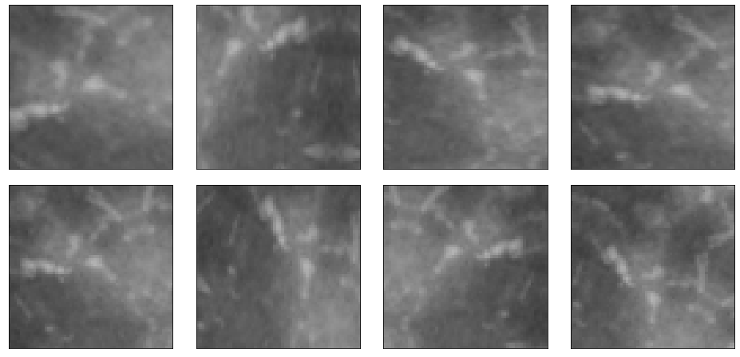

# microcal_classifier

[](https://app.circleci.com/pipelines/github/lorenzomarini96/microcal_classifier?filter=all)
[](https://microcal-classifier.readthedocs.io/en/latest/?badge=latest)
[](https://github.com/lorenzomarini96/microcal_classifier/blob/main/LICENSE)

Convolutional neural networks for the computing methods for experimental physics and data analysis (CMEPDA) course. This project Compare the performance of a convolutional neural networks classification on a microcalcification image dataset, with the performance obtained in an analysis pipeline where the mammographic images containing either microcalcifications or normal tissue are represented in terms of wavelet coefficients.

The repository is structured as follow:
```
microcal_classifier/
├── docs
│   ├── cnnhelper.rst
│   ├── cnn_model.rst
│   ├── cnn_model_v2.rst
│   ├── conf.py
│   ├── data_augmentation.rst
│   ├── index.rst
│   ├── make.bat
│   ├── Makefile
│   ├── requirements.txt
│   ├── wavelet_coeff.rst
│   └── wavelethelper.rst
├── LICENSE
├── microcal_classifier
│   ├── cnnhelper.py
│   ├── cnn_model.py
│   ├── cross_validation.py
│   ├── data_augmentation.py
│   ├── __init__.py
│   ├── micro_classifier.py
│   ├── wavelet_coeff.py
│   └── wavelethelper.py
├── README.md
├── requirements.txt
├── setup.py
└── tests
    ├── __init__.py
    ├── Makefile
    └── test_microcal.py
```

# Motivations

Cluster of microcalcifications can be an early sign of breast cancer. In this python package, an approach based on convolutional neural networks (CNN) for the classification of microcalcification clusters is proposed.

# Materials and methods

## Train, test, validation sets

The provided dataset contains 797 images of 60 $\times$ 60 pixels representing portions of mammogram either containing microcalcification clusters (label=1) or  normal breast tissue (label=0). The available images are already partitioned in a train and a test samples, containing, respectively:

| Sets      | Normal tissue | Microcalcification clusters|
| --------- | ------------- | -------------------------- |
| Train     |      330      |    306                     |
| Test      |       84      |     77                     |

All dataset details are provided in the reference paper (add references).

The datasets are partitionated according the following hierarchy:

```
DATASETS
└── IMAGES
    └── Mammography_micro
        ├── Test
        │   ├── 0
        │   └── 1
        └── Train
            ├── 0
            └── 1
```

The DATASETS folder can be downloaded from ???

Some random images:

 

To define the train and validation set we can use the function **train_test_split**, which split the labels into random train and validation subsets by proportions.

In this case, the first dataset contains 80% of the total number of 396 images, randomly selected within the sample (randomly assigns the specified proportion of files from each label to the new datastores).

| Sets       | Normal tissue | Microcalcification clusters|
| ---------- | ------------- | -------------------------- |
| Train      |      251      |    226                     |
| Validation |       79      |     80                     |
| Test       |       84      |     77                     |

 


## CNN Architecture

### Model

```
_________________________________________________________________
 Layer (type)                Output Shape              Param #   
=================================================================
 conv_1 (Conv2D)             (None, 60, 60, 32)        320       
                                                                 
 maxpool_1 (MaxPooling2D)    (None, 30, 30, 32)        0         
                                                                 
 conv_2 (Conv2D)             (None, 30, 30, 64)        18496     
                                                                 
 maxpool_2 (MaxPooling2D)    (None, 15, 15, 64)        0         
                                                                 
 dropout (Dropout)           (None, 15, 15, 64)        0         
                                                                 
 conv_3 (Conv2D)             (None, 15, 15, 128)       73856     
                                                                 
 maxpool_3 (MaxPooling2D)    (None, 7, 7, 128)         0         
                                                                 
 dropout_1 (Dropout)         (None, 7, 7, 128)         0         
                                                                 
 conv_4 (Conv2D)             (None, 7, 7, 128)         147584    
                                                                 
 maxpool_4 (MaxPooling2D)    (None, 3, 3, 128)         0         
                                                                 
 flatten (Flatten)           (None, 1152)              0         
                                                                 
 dropout_2 (Dropout)         (None, 1152)              0         
                                                                 
 dense_2 (Dense)             (None, 256)               295168    
                                                                 
 dense_3 (Dense)             (None, 128)               32896     
                                                                 
 output (Dense)              (None, 1)                 129       
                                                                 
=================================================================
Total params: 568,449
Trainable params: 568,449
Non-trainable params: 0
_________________________________________________________________
```

## Data augmentation



## Cross validation procedures

Train and test sets can be swapped in a cross validation procedure.

 

Image from https://scikit-learn.org/stable/modules/cross_validation.html

# Binary classification based on wavelet coefficients of the images


# Results

## Performance evaluation

The performance of CNN prediction model was evaluated by computing the area under the receiver-operating characteristic curve (AUC), specificity, sensitivity, F1-score, and accuracy.
Before exploring the metrics, we need to define True Positive (TP), False Positive (FP), True Negative (TN) and False Negative (FN).

$Accuracy = \frac{TP + TN}{TP + FN + FP + TN}$

$Specificity = \frac{TN}{TN + FP}$

$Sensitivity = \frac{TP}{TP + FN}$

$F1 = \frac{2 \times PR \times Recall}{PR + Recall}$


### Precision, Recall and F1-Score

| Model                | Class      | Precision     | Recall|  F1-score | Accuracy | AUC      |
| -------------------- | ---------- | ------------- | ----- | --------- | -------- | -------- |
| CNN                  | Train      |               |       |           |          |          |       
|                      | Test       |               |       |           |          |          |        
|                      |            |               |       |           |          |          |        
| CNN data agu         | Train      |               |       |           |          |          |        
|                      | Test       |               |       |           |          |          |        
|                      |            |               |       |           |          |          |        
| CNN cross validation | Train      |               |       |           |          |          |        
|                      | Test       |               |       |           |          |          |        
|                      |            |               |       |           |          |          |        


### Train, validation, test: loss and accuracy

| Model                | Train Loss | Train Acc     | Val Loss | Val Acc   | Test Loss | Test Acc |  
| -------------------- | ---------- | ------------- | ---------| --------- | --------- | -------- |
| CNN                  |            |               |          |           |           |          |
|                      |            |               |          |           |           |          |
| CNN data agu         |            |               |          |           |           |          |
|                      |            |               |          |           |           |          |
| CNN cross validation |            |               |          |           |           |          |
|                      |            |               |          |           |           |          |


## Loss/Accuracy vs Epoch


### Confusion Matrix

Confusion matrix obtained CNN model (on the left) and with data augmentation (on the right):

    

### ROC Curves


### Correct classification samples


### Incorrect classification samples


# Conclusions


# Useful links:
- https://www.tensorflow.org/tutorials/images/data_augmentation
- https://www.tensorflow.org/tutorials/images/cnn
- 

# References

- Retico: Inserire Link
- 
