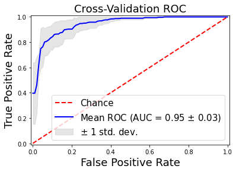

# microcal_classifier

[](https://app.circleci.com/pipelines/github/lorenzomarini96/microcal_classifier?filter=all)
[](https://microcal-classifier.readthedocs.io/en/latest/?badge=latest)
[](https://github.com/lorenzomarini96/microcal_classifier/blob/main/LICENSE)

Convolutional neural networks for the computing methods for experimental physics and data analysis (CMEPDA) course. This project compare the performance of a convolutional neural networks classification on a microcalcification image dataset, with the performance obtained in an analysis pipeline where the mammographic images containing either microcalcifications or normal tissue are represented in terms of wavelet coefficients.

The repository is structured as follow:
```
microcal_classifier/
├── docs
├── LICENSE
├── microcal_classifier
│   ├── cnnhelper.py
│   ├── cnn_model.py
│   ├── cross_validation.py
│   ├── data_augmentation.py
│   ├── __init__.py
│   ├── main_cnn.py
│   ├── main_wavelet_classifier.py
│   ├── wavelet_coeff.py
│   └── wavelethelper.py
├── README.md
├── requirements.txt
├── setup.py
└── tests
    └── test_microcal.py
```

# Motivations

Cluster of microcalcifications can be an early sign of breast cancer. In this python package, an approach based on convolutional neural networks (CNN) for the classification of microcalcification clusters is proposed.

# Materials and methods

## Train, test, validation sets

The provided dataset contains 797 images of 60 $\times$ 60 pixels representing portions of mammogram either containing microcalcification clusters (label=1) or  normal breast tissue (label=0). The available images are already partitioned in a train and a test samples, containing, respectively:

| Sets      | Normal tissue | Microcalcification clusters|
| --------- | ------------- | -------------------------- |
| Train     |      330      |    306                     |
| Test      |       84      |     77                     |


The datasets are partitionated according the following hierarchy:

```
dataset
└── IMAGES
    └── Mammography_micro
        ├── Test
        │   ├── 0
        │   └── 1
        └── Train
            ├── 0
            └── 1
```

The figure shows both images containing microcalcifications and healthy tissue, randomly choosen from the data set:

 

To define the train and validation set we can use the function **train_test_split**, which split the labels into random train and validation subsets by proportions.

In this case, the first dataset contains 80% of the total number of 396 images, randomly selected within the sample (randomly assigns the specified proportion of files from each label to the new datastores).

| Sets       | Normal tissue | Microcalcification clusters|
| ---------- | ------------- | -------------------------- |
| Train      |      251      |    226                     |
| Validation |       79      |     80                     |
| Test       |       84      |     77                     |

 


## CNN Architecture

### Model

```
_________________________________________________________________
 Layer (type)                Output Shape              Param #   
=================================================================
 conv_1 (Conv2D)             (None, 60, 60, 32)        320       
                                                                 
 maxpool_1 (MaxPooling2D)    (None, 30, 30, 32)        0         
                                                                 
 conv_2 (Conv2D)             (None, 30, 30, 64)        18496     
                                                                 
 maxpool_2 (MaxPooling2D)    (None, 15, 15, 64)        0         
                                                                 
 dropout (Dropout)           (None, 15, 15, 64)        0         
                                                                 
 conv_3 (Conv2D)             (None, 15, 15, 128)       73856     
                                                                 
 maxpool_3 (MaxPooling2D)    (None, 7, 7, 128)         0         
                                                                 
 dropout_1 (Dropout)         (None, 7, 7, 128)         0         
                                                                 
 conv_4 (Conv2D)             (None, 7, 7, 128)         147584    
                                                                 
 maxpool_4 (MaxPooling2D)    (None, 3, 3, 128)         0         
                                                                 
 flatten (Flatten)           (None, 1152)              0         
                                                                 
 dropout_2 (Dropout)         (None, 1152)              0         
                                                                 
 dense_2 (Dense)             (None, 256)               295168    
                                                                 
 dense_3 (Dense)             (None, 128)               32896     
                                                                 
 output (Dense)              (None, 1)                 129       
                                                                 
=================================================================
Total params: 568,449
Trainable params: 568,449
Non-trainable params: 0
_________________________________________________________________
```

## Data augmentation

If a dataset is very small like this taken into account, a **Data augmentation** techniques may be used to increase the amount of data by adding slightly modified copies of already existing data or newly created synthetic data from existing data.

Data acumentation is implemented by means of **ImageDataGenerator** class (built in keras). It acts as a regularizer and helps reduce overfitting when training the model.

The following picture shows the effect of random transformation on an image containing microcalcification clusters:


# Binary classification based on wavelet coefficients of the images

The microcal_classifier project allows to extract the wavelet coefficient from the images of the data set and 
use them as features. Some standard machine learning techniques has been chosen to perform the classification of these features
extracted from each image.

To perform the analysis we considered the **Daubechies** family of [wavelet](https://github.com/lorenzomarini96/microcal_classifier/edit/main/README.md#references), in particular, 
the **db5** mother wavelet. As shown in the next figure, each image is decomposed up to the fourth level. 
We found out that the resolution level 1 mainly shows the high-frequency noise included in the mammogram, whereas the levels 2–4 contain the high-frequency components related to the presence of microcalcifications.
Levels greater than 4 exhibited a strong correlation with larger structures possibly present in the normal breast tissue constituting
the background. In order to enhance microcalcifications, the approximation coefficients at level 4 and the detail coefficients at the first level were neglected.


The previous picture shows the wavelet decomposition of a digitized mammogram:
on the left, the original image containing a microcalcification cluster; on the right 4-level
decomposition using Daubechies 5 mother wavelet.

The most common methods used in ML to binary classification took into account in this project are:

- Support Vector Machines
- Naive Bayes
- Nearest Neighbor
- Decision Trees
- Logistic Regression
- Random Forest
- Multi-layer Perceptron


## Cross validation procedures

Train and test sets can be swapped in a cross validation procedure.

 

Image from https://scikit-learn.org/stable/modules/cross_validation.html


# Results

## Performance evaluation

The performance of CNN prediction model was evaluated by computing the area under the receiver-operating characteristic curve (AUC), specificity, sensitivity, F1-score, and accuracy.
Before exploring the metrics, we need to define True Positive (TP), False Positive (FP), True Negative (TN) and False Negative (FN).

$Accuracy = \frac{TP + TN}{TP + FN + FP + TN}$

$Specificity = \frac{TN}{TN + FP}$

$Sensitivity = \frac{TP}{TP + FN}$

$F1 = \frac{2 \times PR \times Recall}{PR + Recall}$


## CNN: Precision, Recall and F1-Score

| Model                | Class      | Precision     | Recall|  F1-score | Accuracy | AUC      |
| -------------------- | ---------- | ------------- | ----- | --------- | -------- | -------- |
|                      |            |               |       |           |          |          |
| CNN                  | 0          |   0.89        |  0.96 | 0.93      |  0.92    | 0.98     |       
|                      | 1          |   0.96        |  0.87 | 0.91      |          |          |        
|                      |            |               |       |           |          |          |        
| CNN data agu         | 0          |   0.88        | 0.99  | 0.93      |  0.93    |  0.98    |        
|                      | 1          |   0.99        | 0.86  | 0.92      |          |          |      

## Machine Learning: Precision, Recall and F1-Score

Moreover, we evaluates the performance of the most common methods utilized in machine learning for binary classification.
The mammographic images containing either microcalcifications or normal tissue are represented in terms of wavelet coefficients.


## CNN: Train, validation, test: loss and accuracy

| Model                | Train Loss    | Train Acc     | Val Loss     | Val Acc      | Test Loss     | Test Acc      |  
| -------------------- | ------------- | ------------- | ------------ | ------------ | ------------- | ------------- |
|                      |               |               |              |              |               |               |
| CNN                  |  0.17         |  0.93         |  0.23        | 0.91         |  0.21         | 0.92          |
|                      |               |               |              |              |               |               |
| CNN data agu         | 0.24          | 0.91          | 0.30         | 0.89         | 0.24          | 0.93          |
|                      |               |               |              |              |               |               |
| CNN cross validation | 0.27 +/- 0.14 |0.90 +/- 0.05  |0.31 +/- 0.14 |0.87 +/- 0.05 | 0.27 +/- 0.15 | 0.89 +/- 0.07 |


## Loss/Accuracy vs Epoch


### Confusion Matrix

#### CNN

Confusion matrix obtained CNN model (on the left) and with data augmentation (on the right):

    

#### Random Forest


## CNN: ROC Curves



## Random Forest: ROC Curves


### Correct classification samples


### Incorrect classification samples


# How to use

## Method 1 (local)

- **step 1**) Download the repository from github
```git clone https://github.com/lorenzomarini96/microcal_classifier.git```
- **step 2**) Change directory: ```cd path/to/microcal_classifier/microcal_classifier```
- **Step 3**) To perform CNN analysis: ```main_cnn.py /path/to/dataset/folder/```

```
$ main_cnn.py -h 

usage: main_cnn.py [-h] [-dp] [-de] [-e] [-ad] [-cv] [-k]

CNN classifiers analysis in digital mammography.

optional arguments:
  -h, --help            show this help message and exit
  -dp , --datapath      path of the data folder.
  -de , --dataexploration 
                        Data exploration: data set partition histogram and image visualization.
  -e , --epochs         Number of epochs for train the CNN.
  -ad , --augdata       Perform data augmentation procedure.
  -cv , --crossvalidation 
                        Perform the cross validation and the plot of ROC curve.
  -k , --kfolds         Number of folds for the cross validation and the plot of ROC curve.

```

```
$ python3 main_cnn.py -dp /home/lorenzomarini/Desktop/microcal_classifier/dataset/IMAGES/Mammography_micro/ -de True -e 25 -ad True -cv True -k 5
```

- **Step 4**) To perform ML analysis:
```
$ main_wavelet_classifier.py -h

usage: main_wavelet_classifier.py [-h] [-dp] [-f] [-l] [-k] [-mlc] [-lt]

ML classifiers analysis in digital mammography.

optional arguments:
  -h, --help            show this help message and exit
  -dp , --datapath      path of the data folder.
  -f , --family         Family wavelet for the feature extraction.
  -l , --level          level of decomposition using Daubechies 5 mother wavelet.
  -k , --kcrossvalidation 
                        Number of folder to use for the cross validation and the plot of ROC curve.
  -mlc , --classifier   Type of machine learning classifier for the k-cross validation.
  -lt , --latex         Print the table with the performance results written in LaTeX format.
```

```
$ python3 main_wavelet_classifier.py -dp /home/lorenzomarini/Desktop/DATASETS_new/IMAGES/Mammography_micro/  -f db5 -l 4 -k 5 -mlc 'Random Forest' -lt True 
```

## Method 2 (demo)
- **step 1**) Open the jupyter notebook in the folder *notebook*
- **step 2**) Download the image data set from [Google Drive](https://drive.google.com/drive/folders/1wqp1YIcqSaoChZd7k7ikwylRFGIarKa6?usp=sharing).
- **Step 4**) To perform CNN analysis: open the notebook CNN_DEMO.ipynb, follow the step in the notebook and work interactively.
- **Step 5**) To perfor ML analysis: open the notebook  ML_WAVELET_DEMO.ipynb, follow the step in the notebook and work interactively.`


## Unit test

- Change directory to the test folder, and type:

```
$ python3 test_microcal.py

----------------------------------------------------------------------
Ran 5 tests in 12.896s

OK
```

## Requirements

```
numpy==1.22.4
matplotlib==3.3.0
keras==2.9.0
Keras-Preprocessing==1.1.2
Pillow==9.1.1
PyWavelets==1.3.0
scikit-image==0.19.3
scikit-learn==1.1.1
scipy==1.8.1
tensorboard==2.9.1
tensorboard-data-server==0.6.1
tensorboard-plugin-wit==1.8.1
tensorflow==2.9.1
tensorflow-estimator==2.9.0
tensorflow-io-gcs-filesystem==0.26.0
```

# Useful links:

- Convolutional neural network:
    - https://www.tensorflow.org/tutorials/images/cnn
    - ImageDataGenerator:
    - https://www.tensorflow.org/tutorials/images/data_augmentation
    - https://www.tensorflow.org/api_docs/python/tf/keras/preprocessing/image/ImageDataGenerator
    - StratifiedKFold:
        - https://scikit-learn.org/stable/modules/cross_validation.html
        - https://scikit-learn.org/stable/modules/generated/sklearn.model_selection.StratifiedKFold.html
- Wavelet transform:
    - https://ataspinar.com/2018/12/21/a-guide-for-using-the-wavelet-transform-in-machine-learning/
    - Pywavelets:
        - https://pywavelets.readthedocs.io/en/latest/
        - https://pywavelets.readthedocs.io/en/latest/ref/2d-dwt-and-idwt.html
        - https://pywavelets.readthedocs.io/en/latest/ref/dwt-coefficient-handling.html
        - https://pywavelets.readthedocs.io/en/v1.3.0_a/ref/2d-dwt-and-idwt.html
        - https://pywavelets.readthedocs.io/en/latest/ref/thresholding-functions.html
- Pillow:
    - https://pillow.readthedocs.io/en/stable/handbook/image-file-formats.html

# References

- [1] [A scalable computer-aided detection system for microcalcification cluster identification in a pan-European distributed database of mammograms](https://www.sciencedirect.com/science/article/abs/pii/S0168900206015439), Retico et al.
- [2] [Ten lectures of Wavelet]( https://jqichina.files.wordpress.com/2012/02/ten-lectures-of-waveletsefbc88e5b08fe6b3a2e58d81e8aeb2efbc891.pdf)
